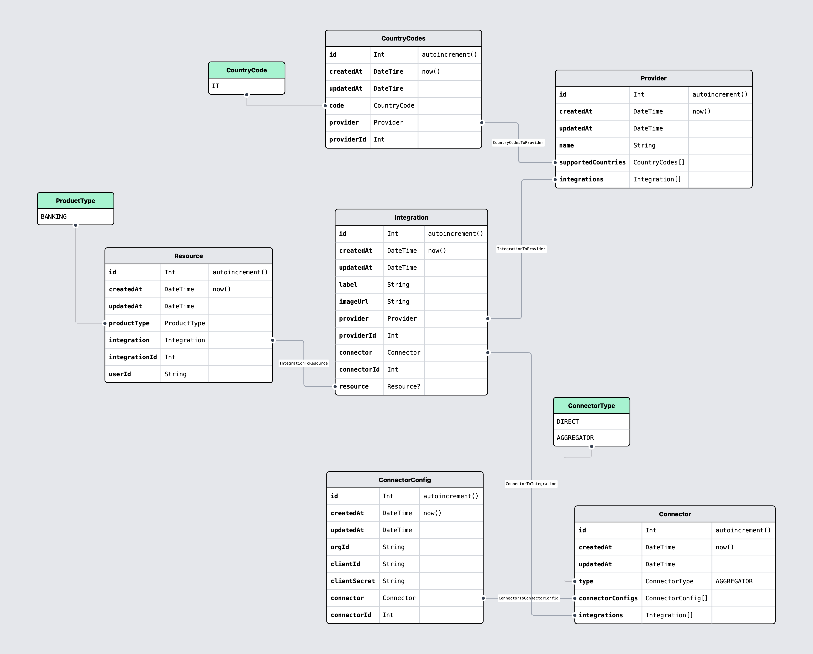

# @projectx/openbanking

## Data Models

Speaking the same language

ProjectX tries to be as clear and consistent as possible with the nomenclature used throughout the documentation and code base.

To that end, here’s a list of what our primitives are and examples of how you can think of them in use.

[See this data model on prismaliser](https://prismaliser.app?code=ZGF0YXNvdXJjZSBkYiB7CiAgcHJvdmlkZXIgPSAicG9zdGdyZXNxbCIKICB1cmwgICAgICA9IGVudigiREFUQUJBU0VfVVJMIikKfQoKZ2VuZXJhdG9yIGNsaWVudCB7CiAgcHJvdmlkZXIgPSAicHJpc21hLWNsaWVudC1qcyIKfQoKbW9kZWwgQ29ubmVjdG9yQ29uZmlnIHsKICBpZCAgICAgICAgSW50ICAgICAgQGlkIEBkZWZhdWx0KGF1dG9pbmNyZW1lbnQoKSkKICBjcmVhdGVkQXQgRGF0ZVRpbWUgQGRlZmF1bHQobm93KCkpCiAgdXBkYXRlZEF0IERhdGVUaW1lIEB1cGRhdGVkQXQKCiAgb3JnSWQgICAgICAgIFN0cmluZyAgICAgICBAZGIuVmFyQ2hhcig2MykKICBjbGllbnRJZCAgICAgU3RyaW5nICAgICAgIEBkYi5WYXJDaGFyKDYzKQogIGNsaWVudFNlY3JldCBTdHJpbmcgICAgICAgQGRiLlZhckNoYXIoNjMpCiAgZW52ICAgICAgICAgIENvbm5lY3RvckVudgogIGNvbm5lY3RvciAgICBDb25uZWN0b3IgICAgQHJlbGF0aW9uKGZpZWxkczogW2Nvbm5lY3RvcklkXSwgcmVmZXJlbmNlczogW2lkXSkKICBjb25uZWN0b3JJZCAgSW50Cn0KCm1vZGVsIENvbm5lY3RvciB7CiAgaWQgICAgICAgIEludCAgICAgIEBpZCBAZGVmYXVsdChhdXRvaW5jcmVtZW50KCkpCiAgY3JlYXRlZEF0IERhdGVUaW1lIEBkZWZhdWx0KG5vdygpKQogIHVwZGF0ZWRBdCBEYXRlVGltZSBAdXBkYXRlZEF0CgogIHR5cGUgICAgICAgICAgICAgQ29ubmVjdG9yVHlwZSAgICAgQGRlZmF1bHQoQUdHUkVHQVRPUikKICBjb25uZWN0b3JDb25maWdzIENvbm5lY3RvckNvbmZpZ1tdCiAgaW50ZWdyYXRpb25zICAgICBJbnRlZ3JhdGlvbltdCn0KCmVudW0gQ29ubmVjdG9yVHlwZSB7CiAgRElSRUNUCiAgQUdHUkVHQVRPUgp9Cgptb2RlbCBJbnRlZ3JhdGlvbiB7CiAgaWQgICAgICAgIEludCAgICAgIEBpZCBAZGVmYXVsdChhdXRvaW5jcmVtZW50KCkpCiAgY3JlYXRlZEF0IERhdGVUaW1lIEBkZWZhdWx0KG5vdygpKQogIHVwZGF0ZWRBdCBEYXRlVGltZSBAdXBkYXRlZEF0CgogIG5hbWUgICAgICAgICAgICAgICAgU3RyaW5nICAgICAgICAgQGRiLlZhckNoYXIoNjMpCiAgbG9nb1VybCAgICAgICAgICAgICBTdHJpbmcgICAgICAgICBAZGIuVmFyQ2hhcig2MykKICBjb25uZWN0b3JQcm92aWRlcklkIFN0cmluZyAgICAgICAgIEBkYi5WYXJDaGFyKDYzKQogIGNvdW50cnlpZXMgICAgICAgICAgQ291bnRyeUNvZGVzW10KCiAgY29ubmVjdG9yICAgQ29ubmVjdG9yIEByZWxhdGlvbihmaWVsZHM6IFtjb25uZWN0b3JJZF0sIHJlZmVyZW5jZXM6IFtpZF0pCiAgY29ubmVjdG9ySWQgSW50ICAgICAgIEB1bmlxdWUKICByZXNvdXJjZSAgICBSZXNvdXJjZT8KfQoKbW9kZWwgUmVzb3VyY2UgewogIGlkICAgICAgICBJbnQgICAgICBAaWQgQGRlZmF1bHQoYXV0b2luY3JlbWVudCgpKQogIGNyZWF0ZWRBdCBEYXRlVGltZSBAZGVmYXVsdChub3coKSkKICB1cGRhdGVkQXQgRGF0ZVRpbWUgQHVwZGF0ZWRBdAoKICBwcm9kdWN0VHlwZSBQcm9kdWN0VHlwZQoKICBpbnRlZ3JhdGlvbiAgIEludGVncmF0aW9uIEByZWxhdGlvbihmaWVsZHM6IFtpbnRlZ3JhdGlvbklkXSwgcmVmZXJlbmNlczogW2lkXSkKICBpbnRlZ3JhdGlvbklkIEludCAgICAgICAgIEB1bmlxdWUKICB1c2VySWQgICAgICAgIFN0cmluZyAgICAgIEBkYi5WYXJDaGFyKDYzKQp9Cgptb2RlbCBDb3VudHJ5Q29kZXMgewogIGlkICAgICAgICBJbnQgICAgICBAaWQgQGRlZmF1bHQoYXV0b2luY3JlbWVudCgpKQogIGNyZWF0ZWRBdCBEYXRlVGltZSBAZGVmYXVsdChub3coKSkKICB1cGRhdGVkQXQgRGF0ZVRpbWUgQHVwZGF0ZWRBdAoKICBjb2RlICAgICAgICAgIENvdW50cnlDb2RlCiAgYWN0aXZlICAgICAgICBCb29sZWFuCiAgaW50ZWdyYXRpb24gICBJbnRlZ3JhdGlvbiBAcmVsYXRpb24oZmllbGRzOiBbaW50ZWdyYXRpb25JZF0sIHJlZmVyZW5jZXM6IFtpZF0pCiAgaW50ZWdyYXRpb25JZCBJbnQKfQoKZW51bSBDb3VudHJ5Q29kZSB7CiAgSVQKfQoKZW51bSBQcm9kdWN0VHlwZSB7CiAgQkFOS0lORwp9CgplbnVtIENvbm5lY3RvckVudiB7CiAgREVWRUxPUE1FTlQKICBTVEFHSU5HCiAgUFJPRFVDVElPTgp9Cg%3D%3D)

- **Connector**: a connector is an implementation of some third-party API that can offer either a single direct connection or an aggregated one to open finance data.
- **Provider**: A product or a service, the actual open-finance data provider that users wants to connect to (e.g. institution, investment platform...)
- **Integration**: An integration represents a `Provider` supported by a `Connector`. There can be multiple integrations for a single provider if multiple connectors support the same provider (e.g. Plaid and GoCardless both gives you the ability to connect to PayPal, in addition we may have a direct PayPal connector for a total of 3 PayPal Integrations).
- **Connector Config**: A specific configuration of a Connector. Contains developer account credentials (e.g. `client_id`, `client_secret`), and misc configs (sandbox vs. production). Some connectors does not require configuration. In the future can also contain sync settings (e.g. Automatically sync all Plaid items using this config).
- **Resource**: Associated with a specific Connector Config. Contains customer credentials (e.g. `access_token`) and gives you the ability to call Provider APIs. Typically created by an End User but could also created by you in the dashboard (which then belongs to your organization).
