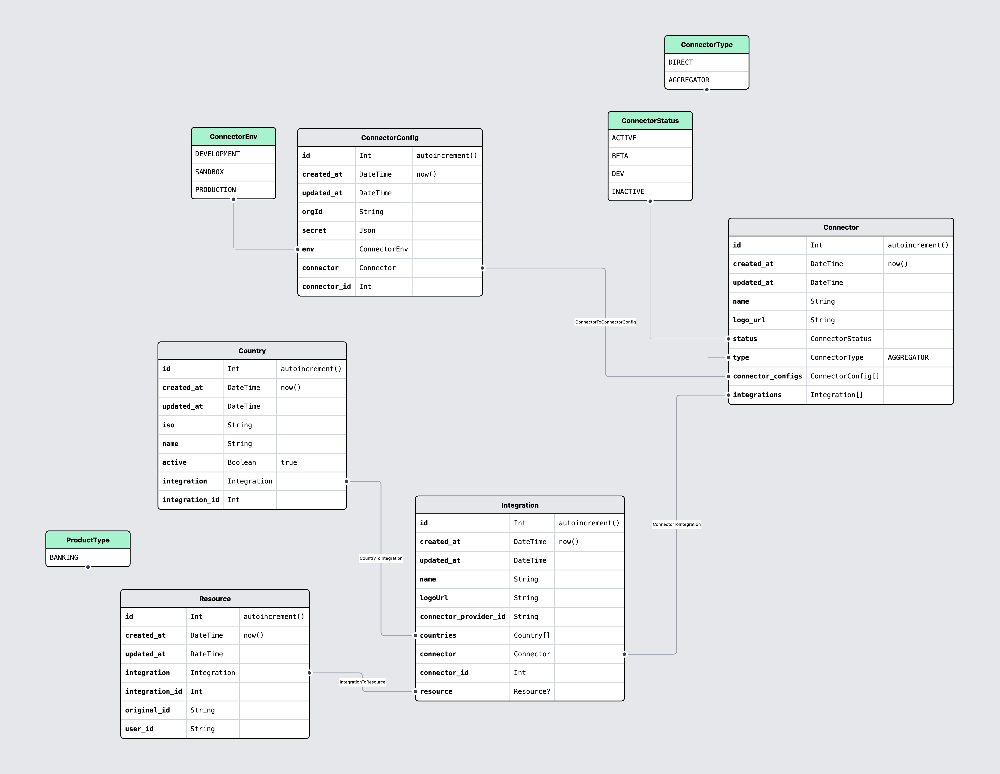
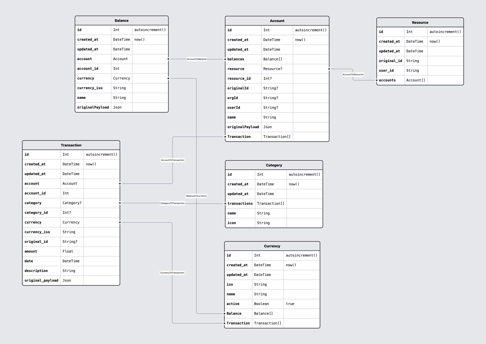

# @projectx/openbanking

## Data Models

Speaking the same language

Badget tries to be as clear and consistent as possible with the nomenclature used throughout the documentation and code base.

To that end, here’s a list of what our primitives are and examples of how you can think of them in use.

### Provider

[See this data model on prismaliser](https://prismaliser.app/?code=ZGF0YXNvdXJjZSBkYiB7CiAgcHJvdmlkZXIgPSAicG9zdGdyZXNxbCIKICB1cmwgICAgICA9IGVudigiREFUQUJBU0VfVVJMIikKfQoKZ2VuZXJhdG9yIGNsaWVudCB7CiAgcHJvdmlkZXIgPSAicHJpc21hLWNsaWVudC1qcyIKfQoKbW9kZWwgQ29ubmVjdG9yQ29uZmlnIHsKICBpZCAgICAgICAgSW50ICAgICAgQGlkIEBkZWZhdWx0KGF1dG9pbmNyZW1lbnQoKSkKICBjcmVhdGVkQXQgRGF0ZVRpbWUgQGRlZmF1bHQobm93KCkpCiAgdXBkYXRlZEF0IERhdGVUaW1lIEB1cGRhdGVkQXQKCiAgb3JnSWQgICAgICAgU3RyaW5nICAgICAgIEBkYi5WYXJDaGFyKDYzKQogIHNlY3JldCAgICAgIEpzb24KICBlbnYgICAgICAgICBDb25uZWN0b3JFbnYKICBjb25uZWN0b3IgICBDb25uZWN0b3IgICAgQHJlbGF0aW9uKGZpZWxkczogW2Nvbm5lY3RvcklkXSwgcmVmZXJlbmNlczogW2lkXSkKICBjb25uZWN0b3JJZCBJbnQKfQoKbW9kZWwgQ29ubmVjdG9yIHsKICBpZCAgICAgICAgSW50ICAgICAgQGlkIEBkZWZhdWx0KGF1dG9pbmNyZW1lbnQoKSkKICBjcmVhdGVkQXQgRGF0ZVRpbWUgQGRlZmF1bHQobm93KCkpCiAgdXBkYXRlZEF0IERhdGVUaW1lIEB1cGRhdGVkQXQKCiAgdHlwZSAgICAgICAgICAgICBDb25uZWN0b3JUeXBlICAgICBAZGVmYXVsdChBR0dSRUdBVE9SKQogIGNvbm5lY3RvckNvbmZpZ3MgQ29ubmVjdG9yQ29uZmlnW10KICBpbnRlZ3JhdGlvbnMgICAgIEludGVncmF0aW9uW10KfQoKZW51bSBDb25uZWN0b3JUeXBlIHsKICBESVJFQ1QKICBBR0dSRUdBVE9SCn0KCm1vZGVsIEludGVncmF0aW9uIHsKICBpZCAgICAgICAgSW50ICAgICAgQGlkIEBkZWZhdWx0KGF1dG9pbmNyZW1lbnQoKSkKICBjcmVhdGVkQXQgRGF0ZVRpbWUgQGRlZmF1bHQobm93KCkpCiAgdXBkYXRlZEF0IERhdGVUaW1lIEB1cGRhdGVkQXQKCiAgbmFtZSAgICAgICAgICAgICAgICBTdHJpbmcgICAgICAgICBAZGIuVmFyQ2hhcig2MykKICBsb2dvVXJsICAgICAgICAgICAgIFN0cmluZyAgICAgICAgIEBkYi5WYXJDaGFyKDYzKQogIGNvbm5lY3RvclByb3ZpZGVySWQgU3RyaW5nICAgICAgICAgQGRiLlZhckNoYXIoNjMpCiAgY291bnRyeWllcyAgICAgICAgICBDb3VudHJ5Q29kZXNbXQoKICBjb25uZWN0b3IgICBDb25uZWN0b3IgQHJlbGF0aW9uKGZpZWxkczogW2Nvbm5lY3RvcklkXSwgcmVmZXJlbmNlczogW2lkXSkKICBjb25uZWN0b3JJZCBJbnQgICAgICAgQHVuaXF1ZQogIHJlc291cmNlICAgIFJlc291cmNlPwp9Cgptb2RlbCBSZXNvdXJjZSB7CiAgaWQgICAgICAgIEludCAgICAgIEBpZCBAZGVmYXVsdChhdXRvaW5jcmVtZW50KCkpCiAgY3JlYXRlZEF0IERhdGVUaW1lIEBkZWZhdWx0KG5vdygpKQogIHVwZGF0ZWRBdCBEYXRlVGltZSBAdXBkYXRlZEF0CgogIHByb2R1Y3RUeXBlIFByb2R1Y3RUeXBlCgogIGludGVncmF0aW9uICAgSW50ZWdyYXRpb24gQHJlbGF0aW9uKGZpZWxkczogW2ludGVncmF0aW9uSWRdLCByZWZlcmVuY2VzOiBbaWRdKQogIGludGVncmF0aW9uSWQgSW50ICAgICAgICAgQHVuaXF1ZQogIHVzZXJJZCAgICAgICAgU3RyaW5nICAgICAgQGRiLlZhckNoYXIoNjMpCn0KCm1vZGVsIENvdW50cnlDb2RlcyB7CiAgaWQgICAgICAgIEludCAgICAgIEBpZCBAZGVmYXVsdChhdXRvaW5jcmVtZW50KCkpCiAgY3JlYXRlZEF0IERhdGVUaW1lIEBkZWZhdWx0KG5vdygpKQogIHVwZGF0ZWRBdCBEYXRlVGltZSBAdXBkYXRlZEF0CgogIGNvZGUgICAgICAgICAgQ291bnRyeUNvZGUKICBhY3RpdmUgICAgICAgIEJvb2xlYW4KICBpbnRlZ3JhdGlvbiAgIEludGVncmF0aW9uIEByZWxhdGlvbihmaWVsZHM6IFtpbnRlZ3JhdGlvbklkXSwgcmVmZXJlbmNlczogW2lkXSkKICBpbnRlZ3JhdGlvbklkIEludAp9CgplbnVtIENvdW50cnlDb2RlIHsKICBJVAp9CgplbnVtIFByb2R1Y3RUeXBlIHsKICBCQU5LSU5HCn0KCmVudW0gQ29ubmVjdG9yRW52IHsKICBERVZFTE9QTUVOVAogIFNBTkRCT1gKICBQUk9EVUNUSU9OCn0K)

- **Connector**: a connector is an implementation of some third-party API that can offer either a single direct connection or an aggregated one to open finance data.
- **Provider**: A product or a service, the actual open-finance data provider that users wants to connect to (e.g. institution, investment platform...)
- **Integration**: An integration represents a `Provider` supported by a `Connector`. There can be multiple integrations for a single provider if multiple connectors support the same provider (e.g. Plaid and GoCardless both gives you the ability to connect to PayPal, in addition we may have a direct PayPal connector for a total of 3 PayPal Integrations).
- **Connector Config**: A specific configuration of a Connector. Contains developer account credentials (e.g. `client_id`, `client_secret`), and misc configs (sandbox vs. production). Some connectors does not require configuration. In the future can also contain sync settings (e.g. Automatically sync all Plaid items using this config).
- **Resource**: Associated with a specific Connector Config. Contains customer credentials (e.g. `access_token`) and gives you the ability to call Provider APIs. Typically created by an End User but could also created by you in the dashboard (which then belongs to your organization).

### Open Banking

TODO: document this better

- **Account**: A bank account
- **Balance**: A balance of a specific Account
- **Category**: A user defined category
- **Transaction**: A transaction
